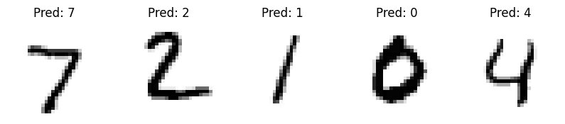

# Handwritten Digit Recognition

 This project uses a Convolutional Neural Network (CNN) to recognize handwritten digits from the MNIST dataset. The model is built using TensorFlow and Keras.

 

## Getting Started
- [**Go to Colab File**](https://colab.research.google.com/drive/1_SvtJXKzthEkmM8zQCC-KI_cpm6SCsyW?usp=sharing)
  
**OR**

 1. **Clone the repository:**
    ```bash
    git clone https://github.com/coderooz/handwritten_digit_recognition.git
    cd handwritten_digit_recognition
    ```

 2. **Install dependencies:**
    ```bash
    pip install tensorflow matplotlib numpy
    ```

 3. **Train the model:**
    ```bash
    python scripts/train_model.py
    ```

 4. **Evaluate the model:**
    ```bash
    python scripts/evaluate_model.py
    ```

 ## Results

 The model's accuracy on the test set will be printed after evaluation.

 ## License

 This project is licensed under the MIT License - see the [LICENSE](LICENSE) file for details.

 ## Acknowledgements

 - The MNIST dataset is provided by [Yann LeCun](http://yann.lecun.com/exdb/mnist/).

 ## Contact
  Ranit Saha - [Coderooz](https://github.com/coderooz)
